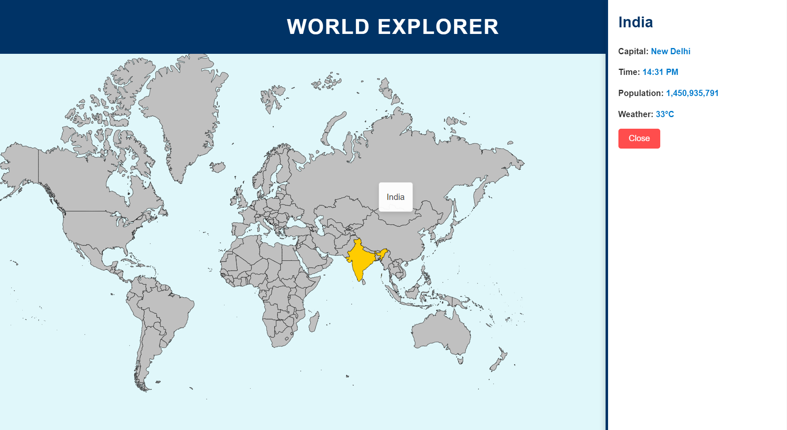

# **World Map**


This project is a simple and interactive world map built using **HTML, CSS, and JavaScript**. It allows users to explore countries by hovering over different regions, which highlights the respective country and can display relevant information.
## 🛠️ Features

- **Interactive Map:** Hover over different countries to see a highlighting effect.
- **Smooth UI/UX:** Responsive design with smooth transitions.
- **Customizable:** Easy to extend and add additional country information or features.
## 🚀 Technologies Used
- **HTML5** for the structure of the map.
- **CSS3** for styling and hover animations.
- **JavaScript** for dynamic interactions and event handling.
## 📂 Project Structure

- `index.html` — Contains the main structure and map SVG elements.
- `styles.css` — Contains all the custom styles for the map layout & hover effects.
- `script.js` — Handles interactions and dynamic country highlighting.
## 📈 How to Use

1. Clone the repository:  
   ```bash
   git clone https://github.com/hariomgupta70427/World-Map.git
   ```

2. Open `index.html` in your browser to view and interact with the map.

## 📷 Screenshots



## 🏆 Future Improvements

- Adding country-specific data pop-ups.
- Integrating zoom and pan functionalities.
- Mobile optimization for better responsiveness.
## 💡 Contribution

Feel free to fork this project, open issues, or submit pull requests to make it better!
## 📄 License

This project is open-source and available under the [MIT](https://choosealicense.com/licenses/mit/) License.


